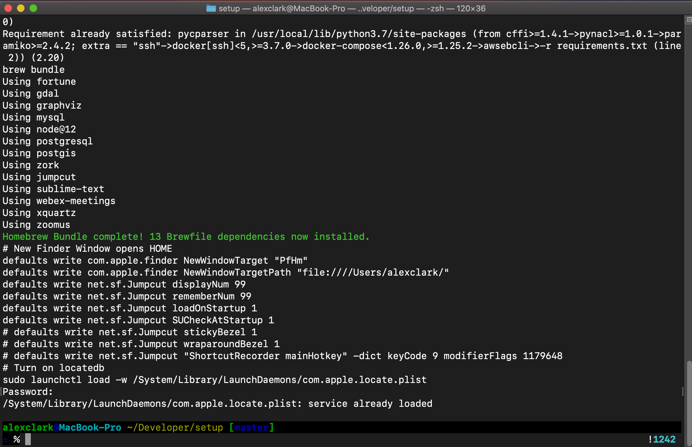
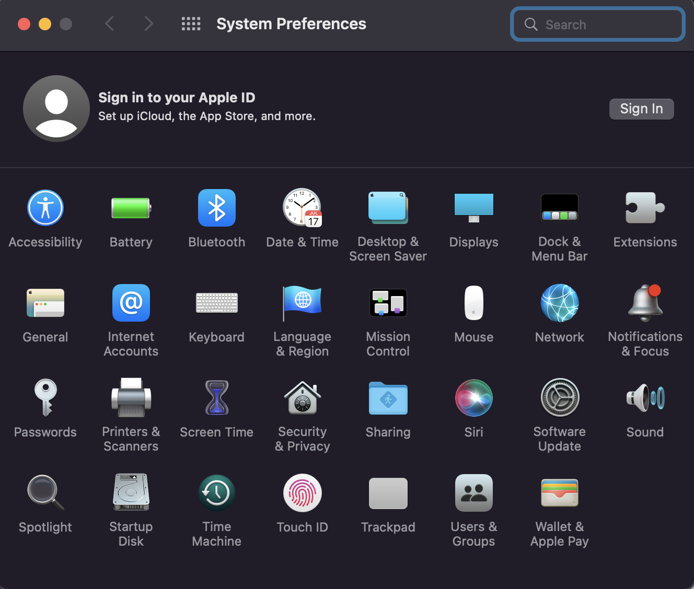

# Setup macOS

In just a few easy steps. Kidding! Never too easy but not too bad either.

## Homebrew

```console
/bin/bash -c "$(curl -fsSL https://raw.githubusercontent.com/Homebrew/install/HEAD/install.sh)"
```

## Oh My Zsh

```console
sh -c "$(curl -fsSL https://raw.github.com/robbyrussell/oh-my-zsh/master/tools/install.sh)"

## Dotfiles

```console
sh -c "$(curl -fsSL https://raw.githubusercontent.com/aclark4life/setup-macos/main/dotfiles.sh)"
```

## Python

## Everything Else

Just a few more steps! Hang in there.

### Firefox + BitWarden

Install Firefox then install the [Bitwarden Password Manager Add-On](https://addons.mozilla.org/en-US/firefox/addon/bitwarden-password-manager/)

```console
brew install --cask firefox
```

### Developer

Update dotfiles and repositories defined in [.checkoutmanager.cfg](https://github.com/reinout/checkoutmanager/blob/master/checkoutmanager/sample.cfg) via ``up`` alias.



```console
pipx install checkoutmanager
up
```

## More Steps

OK, I lied! More steps.

### Homebrew

```
make brew-bundle
make brew-services
```

### User Defaults

```
make defaults-write
```

### System Preferences

Click your way to the finish.



#### Accessibility

- Zoom → ☑︎ Use scroll gesture with modifier keys to zoom: [^Control]

#### Battery

- Battery → Turn display off after [Never]
- Battery → ☐ Slightly dim the display when on battery power
- Battery → ☐ Enable Power Nap while on battery power
- Power Adapter → Turn display off after [Never]
- Power Adapter → ☐ Enable Power Nap while plugged into a power adapter

#### Bluetooth

- ☑︎ Show Bluetooth in menu bar

#### Desktop & Screen Saver

- Desktop

#### Displays

- ☐ Automatically adjust brightness

#### Dock & Menu Bar

- Dock & Menu Bar → ☐ Show recent applications in Dock

#### Keyboard

- Input Sources → ☑︎ Show input menu in menu bar
- Shortcuts → Mission Control → ☑︎ Move left a space [⌘←]
- Shortcuts → Mission Control → ☑︎ Move right a space [⌘→]

#### Mission Control

- Keyboard and Mouse Shortcuts → Mission Control → Middle Mouse Button
- ☐ Displays have separate spaces

#### Security & Privacy

- General → A login password has been set for this user → ☐ Require password

#### Trackpad

- More Gestures → ☐ Swipe between pages

#### Users & Groups

- alexclark → Login Items → + Jumpcut
- alexclark → Login Items → + pCloud Drive
- Login Options → Automatic Login → alexclark

### Terminal

- ⌘ ++++
- Terminal → Shell → Use Settings as Default

#### Preferences…

##### General

- New tabs open with: [Default Working Directory]

##### Profiles → Advanced → Bell

- ☐ Audible bell 
- ☐ Visual bell 
- ☐ Badge app and window Dock 
- ☐ Bounce app icon when in background 

##### Profiles → Shell

- [Close the window] When the shell exits
- [Never] Ask before closing

##### Profiles → Window

- Window Size → Columns → 120
- Window Size → Rows → 36

### Extensions

- [Measure-it](https://addons.mozilla.org/en-US/firefox/addon/measure-it/)
