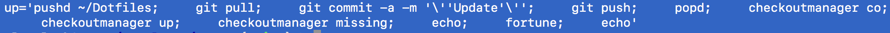

# Setup macOS

In just a few easy steps! Kidding. Never easy enough, but not too bad either.

## Homebrew

First, install Homebrew.

```console
/bin/bash -c "$(curl -fsSL https://raw.githubusercontent.com/Homebrew/install/HEAD/install.sh)"
```

## Oh My Zsh

Second, install Oh My ZSH.

```console
sh -c "$(curl -fsSL https://raw.github.com/robbyrussell/oh-my-zsh/master/tools/install.sh)"
```

## Python + pipx

Third, install Python via pipx. 

```console
brew install pipx
```

## Everything Else

Just a few more steps! Hang in there.

### Firefox + LastPass

Install Firefox then install the [LastPass Password Manager Add-On](https://addons.mozilla.org/en-US/firefox/addon/lastpass-password-manager).

```console
brew install --cask firefox
```

### Dotfiles

Requires [dotfiles](https://pypi.org/project/dotfiles) and GitHub Personal access token from [GitHub → Settings → Developer settings → Personal access tokens](https://github.com/settings/tokens).


```console
pipx install dotfiles
sh -c "$(curl -fsSL https://raw.githubusercontent.com/aclark4life/setup/main/dotfiles.sh)"
```

### Developer

Update dotfiles and repositories defined in [.checkoutmanager.cfg](https://github.com/reinout/checkoutmanager/blob/master/checkoutmanager/sample.cfg) via ``up`` alias.



```console
pipx install checkoutmanager
up
```

### System Preferences

#### Accessibility

- Zoom → ☑︎ Use scroll gesture with modifier keys to zoom: [^Control]

#### Battery

- Battery → Turn display off after [Never]
- Battery → ☐ Slightly dim the display when on battery power (hell no!)
- Battery → ☐ Enable Power Nap while on battery power

#### Displays

- ☐ Automatically adjust brightness (hell no!)

#### Dock & Menu Bar

- Dock & Menu Bar → ☐ Show recent applications in Dock

#### Keyboard

- Input Sources → ☑︎ Show input menu in menu bar
- Shortcuts → Mission Control → ☑︎ Move left a space [⌘←]
- Shortcuts → Mission Control → ☑︎ Move right a space [⌘→]

#### Mission Control

- Keyboard and Mouse Shortcuts → Mission Control → Middle Mouse Button
- ☐ Displays have separate spaces

#### Security & Privacy

- General → A login password has been set for this user → ☐ Require password

#### Trackpad

- More Gestures → ☐ Swipe between pages

#### Users & Groups

- Alex Clark → Login Items → + pCloud Drive
- Alex Clark → Login Items → + Jumpcut
- Login Options → Automatic Login → Alex Clark

### Terminal

- ⌘ ++++
- Terminal → Shell → Use Settings as Default

### Terminal → Preferences…

#### General

- New tabs open with: [Default Working Directory]

#### Profiles → Window

- Window Size → Columns → 120
- Window Size → Rows → 36

#### Profiles → Shell

- Terminal → Preferences → Profile → Default → Shell → [Close the window] When the shell exits
- Terminal → Preferences → Profile → Default → Shell → [Never] Ask before closing

#### Profiles → Advanced → Bell

- ☐ Audible bell 
- ☐ Visual bell 
- ☐ Badge app and window Dock 
- ☐ Bounce app icon when in background 
